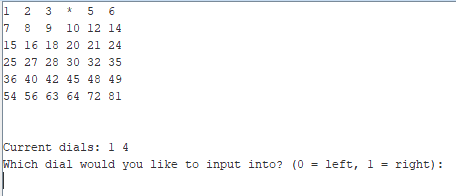
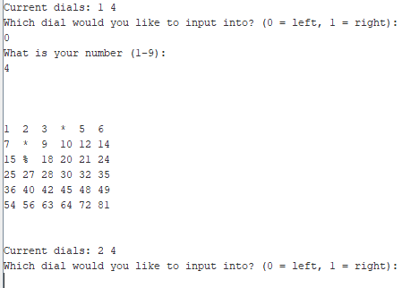
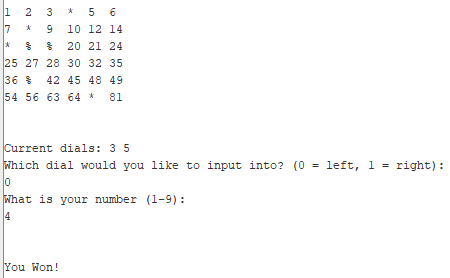
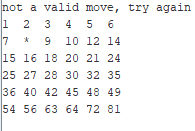

# MIPS-multiplication-game
# Uses MARS.jar

The one and only bug is when running at full speed, the variable determining who's winning move it was is just wrong. 
At any other speed it works fully fine

# How to play 
 

- 2 pivots are present and a row of numbers from 1-9
- The computer goes first
- The product of the 2 pivots will be mapped on the 6x6 table of products of numbers from 1-9. 
## First to get 3 in a row either vertically or horizontally wins.

## bonus
Both the computer and user cannot input an invalid move 

